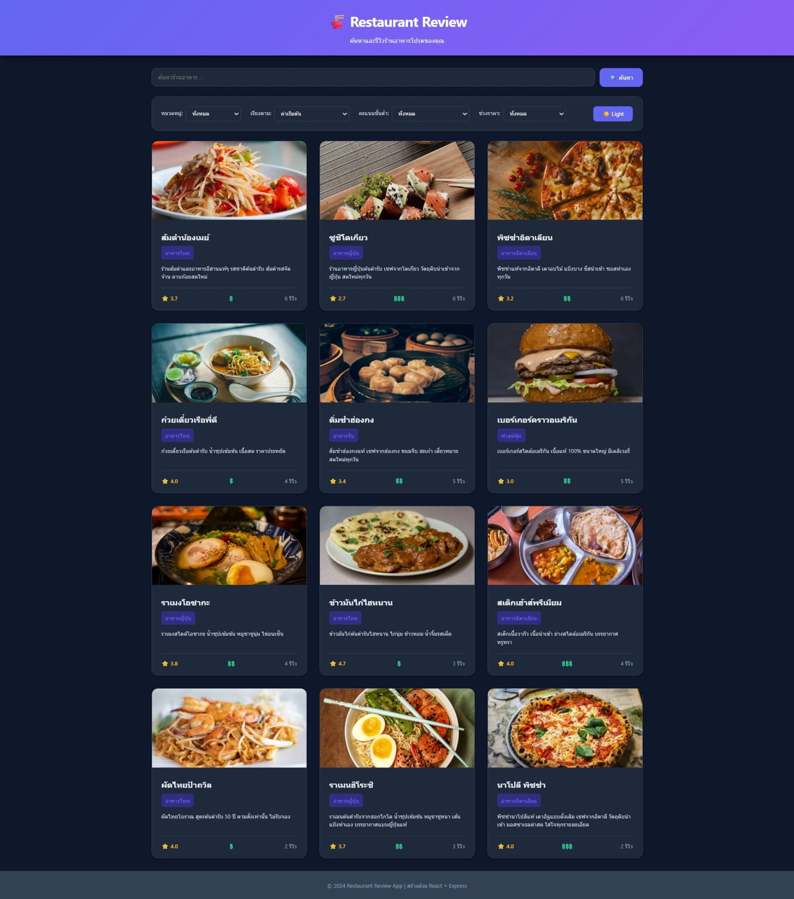
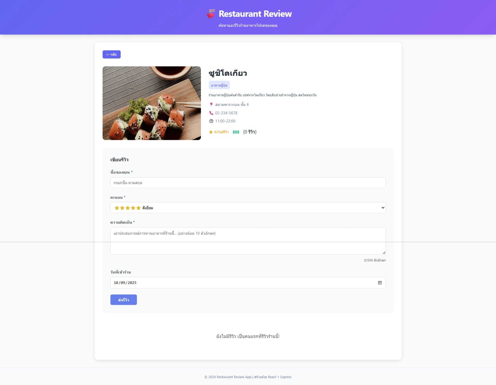
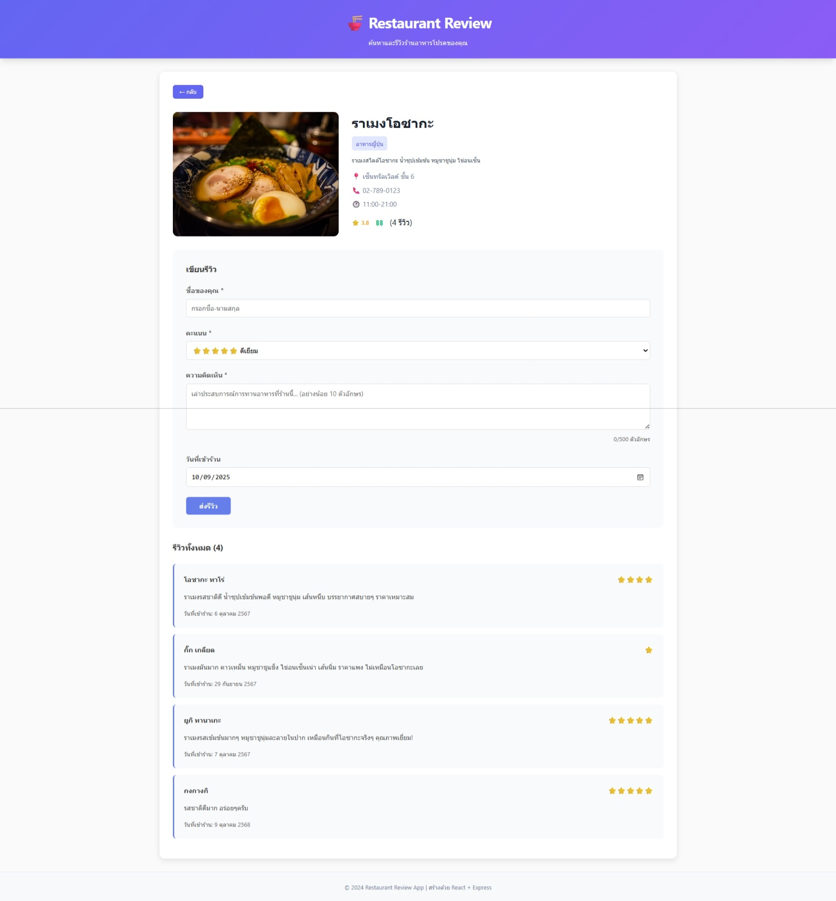
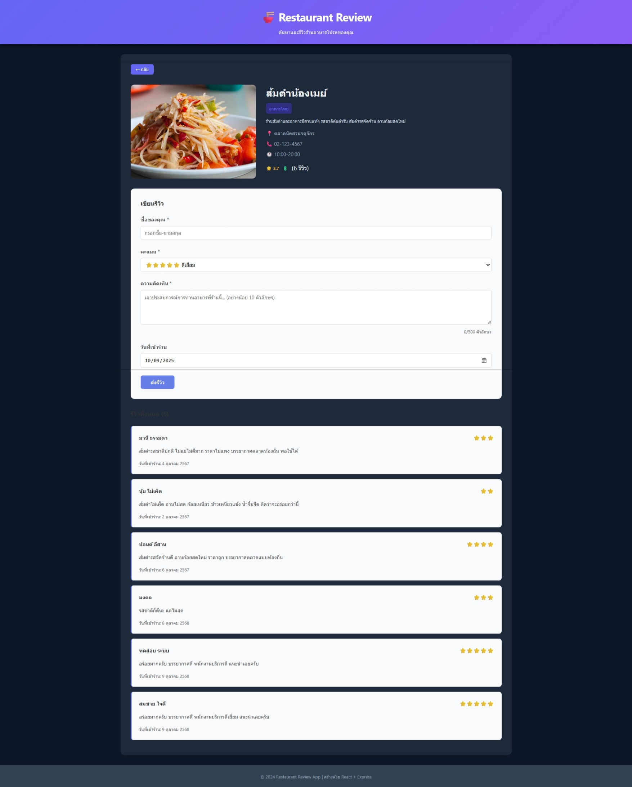

# Restaurant Review Website

## รายละเอียดโปรเจค
เว็บสำหรับรีวิวร้านอาหารขนาดเล็กที่ประกอบด้วย frontend (React + Vite) และ backend (Node.js + Express) โดยเก็บข้อมูลแบบ JSON file เหมาะสำหรับการสาธิตการทำ CRUD, การค้นหา/กรอง, การจัดการรีวิว และการคำนวณ rating อัตโนมัติ

## เทคโนโลยีที่ใช้
- Frontend: React 18 + Vite (โฟลเดอร์ `frontend/`) — UI สำหรับดูรายการร้าน ค้นหา กรอง ดูรายละเอียด และเพิ่มรีวิว
- Backend: Node.js + Express (โฟลเดอร์ `backend/`) — REST API ที่เก็บข้อมูลเป็นไฟล์ JSON ใน `backend/data/`
- Database: JSON File Storage 

## โครงสร้างไฟล์สำคัญ
```text
restaurant-review-app/
├── backend/
│   ├── data/
│   │   ├── restaurants.json      # ข้อมูลร้านอาหาร
│   │   └── reviews.json          # ข้อมูลรีวิว (ว่างเพื่อเก็บรีวิวที่เพิ่ม)
│   ├── routes/
│   │   ├── restaurants.js        # API endpoints สำหรับร้านอาหาร (โครงสร้าง 40%)
│   │   └── reviews.js            # API endpoints สำหรับรีวิว (โครงสร้าง 30%)
│   ├── middleware/
│   │   └── validation.js         # Middleware ตรวจสอบข้อมูล (ตัวอย่าง 1 ฟังก์ชัน)
│   ├── utils/
│   │   └── fileManager.js        # ฟังก์ชันจัดการไฟล์ JSON (100%)
│   ├── server.js                 # Main server file (โครงสร้าง 60%)
│   ├── package.json              # Dependencies และ scripts (100%)
│   ├── .env.example              # ตัวอย่างไฟล์ environment (100%)
│   └── .gitignore                # ไฟล์ที่ไม่ต้องการ commit (100%)
│
└── frontend/
    ├── src/
    │   ├── components/
    │   │   ├── RestaurantList.jsx   # แสดงรายการร้าน (100%)
    │   │   ├── RestaurantCard.jsx   # การ์ดร้าน (100%)
    │   │   ├── RestaurantDetail.jsx # รายละเอียดร้าน (โครงสร้าง 30%)
    │   │   ├── SearchBar.jsx        # แถบค้นหา (100%)
    │   │   ├── FilterPanel.jsx      # แผงกรอง (โครงสร้าง 40%)
    │   │   ├── ReviewForm.jsx       # ฟอร์มรีวิว (โครงสร้าง 40%)
    │   │   └── ReviewList.jsx       # แสดงรีวิว (100%)
    │   ├── services/
    │   │   └── api.js               # ฟังก์ชันเรียก API (โครงสร้าง 30%)
    │   ├── App.jsx                  # Main App component (โครงสร้าง 60%)
    │   ├── App.css                  # Styling หลัก (100%)
    │   └── main.jsx                 # Entry point (100%)
    ├── index.html                   # HTML template (100%)
    ├── package.json                 # Dependencies และ scripts (100%)
    ├── vite.config.js               # Vite configuration (100%)
    └── .gitignore                   # ไฟล์ที่ไม่ต้องการ commit (100%)
```

## Features ที่ทำได้
### Required Features
- [x] แสดงรายการร้านอาหาร
- [x] ค้นหาร้าน
- [x] กรองตามหมวด/rating/ราคา
- [x] ดูรายละเอียดร้าน
- [x] เพิ่มรีวิว
- [x] Validation
- [x] อัพเดท rating อัตโนมัติ

### Bonus Features
- [x] Sort restaurants
- [x] Responsive design
- [x] Animations

## วิธีติดตั้งและรัน

### Backend
```bash
cd backend
npm install
cp .env.example .env
npm run dev
```

### Frontend
```bash
cd frontend
npm install
npm run dev
```

## API Endpoints
- GET `/api/restaurants` - ดึงรายการร้านทั้งหมด
- GET `/api/restaurants/:id` - ดึงร้านตาม ID
- POST `/api/reviews` - เพิ่มรีวิว
- GET `/api/stats` - ดึงสถิติ

## Screenshots
### หน้าแรก
- Light Mode  


- Dark Mode  


### รายละเอียดร้าน  


### ฟอร์มรีวิว  
  

## ผู้พัฒนา
- นาย สรุรเชษฐ์ เป็งคำ
- รหัสนักศึกษา: 68543210080-6
- Email: surachet.pengcom@live.rmutl.ac.th

## License
MIT License
